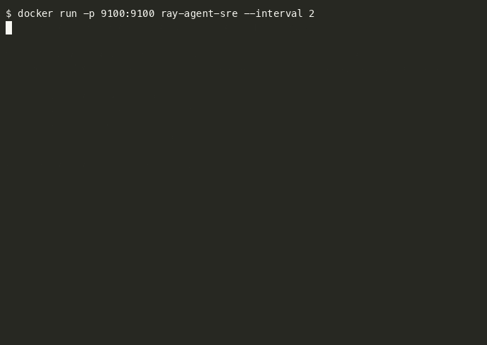

# ray-agent-sre

Prometheus exporter for Ray cluster health and LangGraph agent run traces. Built
as SRE tooling for an AI/ML platform team: one `/metrics` endpoint, one Grafana
dashboard, covering both the compute layer (Ray) and the orchestration layer
(LangGraph agents running on top of it).



## What this is / isn't

This is a proof of concept run locally against a single-node Ray cluster
(`ray.init()` on this machine) and a small LangGraph graph, not a claim of
running against a production multi-node Ray cluster. The collector code talks
to Ray through the public `ray.util.state` API, which is the same API a real
multi-node cluster exposes, so the exporter does not need to change to point
at a real cluster. That has not been exercised here.

## Why this exists

Ray SRE work usually means answering two questions fast: is the cluster
healthy (nodes, actors, tasks), and are the agent graphs running on top of it
healthy (per-node latency, retries, errors). Ray ships a dashboard, LangGraph
ships tracing hooks, but there's no single low-cardinality Prometheus surface
that covers both together. This exporter is that surface.

## Architecture

```
                    +----------------------+
                    |   Ray cluster        |
                    |  (local single node) |
                    +----------+-----------+
                               | ray.util.state API
                               v
+----------------+   +--------------------+   +------------------+
| LangGraph graph |-->| RayMetricsCollector |   | scrape loop      |
| (instrumented   |   | + GraphRunTracer    |-->| every N seconds  |
|  node wrapper)  |   +--------------------+   +--------+---------+
+----------------+                                       |
                                                          v
                                              +------------------------+
                                              | prometheus_client       |
                                              | CollectorRegistry        |
                                              | GET /metrics (port 9100) |
                                              +------------------------+
                                                          |
                                                          v
                                              +------------------------+
                                              | Prometheus scrape       |
                                              | Grafana dashboard        |
                                              | (grafana/dashboard.json) |
                                              +------------------------+
```

## Metrics exported

Ray cluster metrics (from `ray.util.state.list_nodes/list_actors/list_tasks`):

| metric | type | labels | meaning |
|---|---|---|---|
| `ray_node_up` | gauge | `node_id` | 1 if node is alive, 0 otherwise |
| `ray_node_cpu_available` | gauge | `node_id` | available CPU on node |
| `ray_node_cpu_total` | gauge | `node_id` | total CPU on node |
| `ray_cluster_node_count` | gauge | - | total nodes in cluster |
| `ray_cluster_alive_node_count` | gauge | - | nodes currently alive |
| `ray_actor_state_count` | gauge | `state` | actor count by state (ALIVE, DEAD, RESTARTING, ...) |
| `ray_task_state_count` | gauge | `state` | task count by state (FINISHED, FAILED, RUNNING, ...) |

LangGraph run metrics (from the `GraphRunTracer` node wrapper):

| metric | type | labels | meaning |
|---|---|---|---|
| `langgraph_node_runs_total` | counter | `node` | total invocations of a graph node |
| `langgraph_node_errors_total` | counter | `node` | invocations that raised |
| `langgraph_node_retries_total` | counter | `node` | retries triggered after an error |
| `langgraph_node_latency_seconds` | histogram | `node` | wall clock latency per node invocation |

The Grafana dashboard in `grafana/dashboard.json` has one panel per metric
above, so importing it against a Prometheus datasource scraping this exporter
works with no edits.

## Running it

```bash
python3.12 -m venv .venv
. .venv/bin/activate
pip install -r requirements.txt
python -m ray_agent_sre.server --port 9100 --interval 5
curl localhost:9100/metrics
```

`server.py` starts a local single-node Ray cluster, builds a small LangGraph
graph wrapped with `GraphRunTracer` (one node deliberately fails on its first
call and succeeds on retry, to produce non-zero retry/error series), runs it
on a loop, and refreshes Ray cluster metrics from `ray.util.state` on the same
loop.

## Docker

```bash
docker build -t ray-agent-sre .
docker run -p 9100:9100 ray-agent-sre
```

## Kubernetes

`k8s/deployment.yaml` and `k8s/service.yaml` run the exporter as a Deployment
with a ClusterIP Service on port 9100 and a `prometheus.io/scrape` annotation.
They assume the exporter's own local Ray instance (started in-process, see
above) rather than pointing at an external Ray cluster; wiring this at a real
cluster's GCS address is a `RAY_ADDRESS` env var away but not done here.

## Tests

```bash
pip install -r requirements.txt
pytest -v
```

Tests cover the metrics formatting logic directly (`RayMetricsCollector`,
`GraphRunTracer`) using fixture data, not just imports, plus one integration
test that starts a real local Ray instance and confirms `ray.util.state`
snapshots parse into the collector without error.

## Repo layout

```
ray_agent_sre/
  ray_metrics.py       # Ray -> Prometheus gauges
  langgraph_metrics.py # LangGraph node wrapper -> Prometheus counters/histogram
  demo_graph.py         # small LangGraph graph used by server.py and the demo
  server.py             # wires collectors together, serves /metrics
tests/
grafana/dashboard.json
k8s/deployment.yaml
k8s/service.yaml
Dockerfile
```
